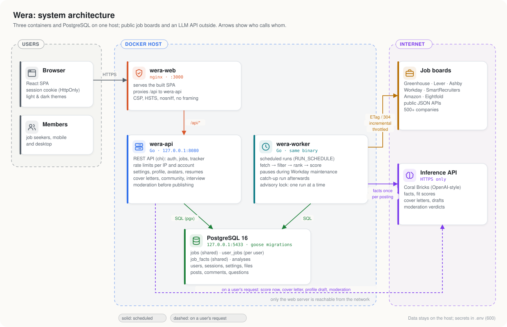
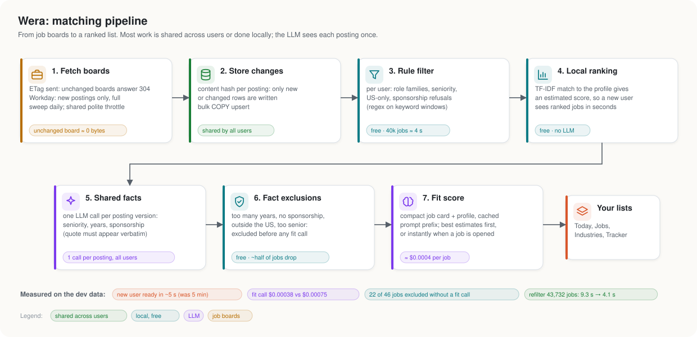

# Wera

[](https://github.com/jessechumo/Wera/actions/workflows/ci.yml)
[](https://github.com/jessechumo/Wera/actions/workflows/ci.yml)
[](https://github.com/jessechumo/Wera/releases)
[](go.mod)
[](https://www.conventionalcommits.org)
[](LICENSE)

**Wera** (Swahili slang for a job or gig) is a self-hosted job radar. It collects postings from public job-board feeds (Greenhouse, Lever, Ashby, Workday, SmartRecruiters, Eightfold, and amazon.jobs) for 570+ companies across 28 industries, filters them with configurable rules, scores each one against your resume with an LLM on [Coral Bricks](https://www.coralbricks.ai), and serves the results through a REST API. Wera does not apply on your behalf. You review the matches and apply yourself.

The dashboard lives in [wera-frontend](https://github.com/jessechumo/Wera-Frontend), and the Chrome extension (save jobs from any page, cover letters, tailored resumes, filling applications) in [wera-extension](https://github.com/jessechumo/wera-extension).

## Architecture



Three containers share one PostgreSQL database on a single host. `wera-web` (nginx) is the only service reachable from the network; it serves the dashboard and proxies `/api` to `wera-api`. `wera-worker` runs the matching pipeline on a schedule. Both are the same Go binary.

## How matching works



1. **Fetch** each company's board once, for everyone. Boards that support ETags answer `304 Not Modified` when nothing changed; Workday boards list only new postings, with a full sweep once a day. A shared throttle keeps requests few and spaced out.
2. **Store** only new or changed postings (by content hash), with a bulk `COPY`.
3. **Filter** per user with `config/roles.yaml` and their preferences: role families, seniority, US-only, and explicit sponsorship refusals. No LLM cost; a new user's 40,000 jobs take about 4 seconds.
4. **Rank locally** with TF-IDF against the user's profile. These estimates show a new user ranked matches within seconds of signing up and decide which jobs the LLM scores first.
5. **Extract shared facts** once per posting with the LLM: seniority, years required, sponsorship (the quote must appear verbatim in the posting), work mode and a short digest. Every user reuses them.
6. **Exclude on facts** at no cost: jobs needing too many years, refusing sponsorship, outside the US or too senior never reach a per-user call.
7. **Score fit** per user from a compact job card plus their profile, sent as a cached prompt prefix. Opening an unscored job scores it immediately.

Measured on the development data: a new account is ready in about 5 seconds (previously 5 minutes), a fit call costs $0.00038 against $0.00075 for a full-posting call, and about half of a user's candidates are excluded from shared facts without any per-user call.

## Features

- **Matching:** per-user filters, local estimates, shared facts, and fit scores with reasons, skills matched and missing, and the sponsorship quote
- **Resumes:** each user keeps a structured resume (imported exactly from LaTeX in the popular "Jake's resume" template, converted from the uploaded resume by the AI with every line copied verbatim, or started from the template), rendered with [Typst](https://typst.app) in that template's look in about 50 ms. Fitting to one page tries the most readable layout first (down to 10pt) and only then drops the fewest low-priority bullets. Live SVG previews, PDF and `.tex` export, and keyword coverage against each posting. A tailored copy per job reorders skills and rewords bullets through ids only (no new roles, numbers or skills), and drops the bullets least relevant to the job only when the page is full
- **Cover letters:** written for one job from the user's profile and resume without repeating the resume; editable, with dashes cleaned out
- **Community:** a blog for offers, interview experiences and tips, with comments and reactions; every post and comment is reviewed by an AI moderator first (violence, harassment, cheating or faked credentials, spam, off-topic) and refused with a reason
- **Interview prep:** multiple-choice questions by domain (algorithms, system design, databases, OS and networking, ML, behavioral) and difficulty, with explanations and progress
- **Sponsorship:** what each company's postings say about visa sponsorship, built from data already extracted while scoring
- **Chrome extension API:** revocable per-browser tokens, application details (filled into forms), private jobs saved from any page (deduplicated, scored, added to the tracker), AI reading of job pages (the description is cut from the page text, never retyped), drafted answers to application questions, and the tailored resumes above (the extension attaches the tailored PDF)
- **Accounts:** sessions, profile pictures, resume viewing, settings (theme, default sort, notification preferences, hidden companies), CSV export, account deletion
- **Operations:** Prometheus metrics, per-user and global monthly LLM budgets, maintenance-aware scheduling, version in `/healthz`

## Make it yours

Wera is driven by configuration and per-user profiles:

- `config/companies.yaml`: the companies to watch, each tagged with an industry from `config/industries.yaml`
- `config/roles.yaml`: the catalog of role families and seniority levels users pick from, plus location and sponsorship rules
- Each user's profile (stored in the database): the text the LLM scores against and their filter preferences

New users build their profile in the dashboard: they upload a resume PDF (or paste the text), answer a short questionnaire (experience, work authorization, locations, work modes, industries, target roles) and pick role families and seniority levels. The LLM drafts the profile from the resume and answers, the user reviews and edits it, and saving it filters and ranks their jobs on the spot.

## Quick start

Requirements: Go 1.27+, Docker, and a Coral Bricks API key. Resume rendering needs [typst](https://github.com/typst/typst/releases) 0.14 on `PATH` (or `TYPST_BIN`); the Docker image includes it.

```bash
cp .env.example .env                               # add CORAL_API_KEY
docker compose up -d postgres
make migrate                                       # create tables
go run ./cmd/wera serve                            # API on http://localhost:8080
```

Then run the dashboard (`../wera-frontend`, `npm run dev`), sign up, and set up your profile. `go run ./cmd/wera pipeline` runs one full fetch, filter, and score for every user.

To use an existing `profile/profile.md` instead of the setup flow, create an account and import it:

```bash
go run ./cmd/wera users create --email you@example.com --admin
go run ./cmd/wera users import-profile --email you@example.com --file profile/profile.md
```

## Run as a server

To run everything in Docker, with the frontend cloned next to this repo as `../wera-frontend`:

```bash
cp .env.example .env            # set CORAL_API_KEY and a random POSTGRES_PASSWORD
docker compose up -d --build    # postgres, migrations, API, worker, dashboard
```

To stamp the deployed version into the images (shown in `/healthz` and the dashboard footer):

```bash
WERA_VERSION=$(git describe --tags --always) WERA_COMMIT=$(git rev-parse --short HEAD) \
WERA_WEB_COMMIT=$(git -C ../wera-frontend rev-parse --short HEAD) docker compose up -d --build
```

The dashboard is served at `http://<server-ip>:3000` (`WEB_PORT`). Migrations run automatically before the API and worker start. Postgres (`5433`) and the API (`8080`) bind to `127.0.0.1` only, so the dashboard is the only service other machines can reach. Docker-published ports bypass `ufw`, so to limit the dashboard to your LAN, add a rule to the `DOCKER-USER` chain:

```bash
iptables -I DOCKER-USER -p tcp -m conntrack --ctdir ORIGINAL --ctorigdstport 3000 ! -s 192.168.1.0/24 -j DROP
```

Released images are published to `ghcr.io/jessechumo/wera:<version>`.

### Public access

To let people outside your network use Wera, give it a public HTTPS address without opening router ports, for example with a [Cloudflare Tunnel](https://developers.cloudflare.com/cloudflare-one/connections/connect-networks/) to `http://localhost:3000` (or host the dashboard on Vercel and tunnel the API). Then set `COOKIE_SECURE=true`, `TRUST_PROXY=true`, and `PUBLIC_ORIGINS=https://<your-domain>` in `.env` and restart. Served over HTTPS, the dashboard's HSTS header stops downgrade attacks.

### Accounts

Every API route except signup and login needs a session. People sign up in the dashboard (turn this off with `SIGNUP_ENABLED=false`; `SIGNUPS_PER_HOUR` limits sign-ups per IP), or you create accounts from the shell; `create` and `passwd` print a generated password:

```bash
docker exec wera-api /app/wera users create --email you@example.com --name You --admin
```

Admins can trigger runs and see overall usage and each user's spend. Everyone shares one Coral Bricks key, so spending is capped three ways: per user per run (`MAX_COST_PER_RUN_USD`), per user per month (`USER_MONTHLY_BUDGET_USD`, default $10; change one user's with `wera users budget`), and for all users together per month (`MAX_MONTHLY_COST_USD`). Jobs over a limit stay pending until the next month or a higher budget.

## Being a good citizen to job boards

Wera reads the same public JSON endpoints the companies' own career pages use, and it keeps its footprint small: conditional requests (ETags, so unchanged boards cost a `304`), incremental listing on Workday with one full sweep a day, details fetched only for postings it has not seen, a shared throttle (a few concurrent requests, spaced out), per-run caps, an identifying User-Agent with a contact address, backing off when a board asks (`Retry-After`), and a pause during Workday's weekly maintenance window. Each board is fetched once for all users. If you run Wera publicly, review each provider's terms of use and keep `RUN_SCHEDULE` modest.

## Security

See [SECURITY.md](SECURITY.md) for how to report a vulnerability and a summary of the protections: hashed sessions, per-IP and per-account rate limits, origin checks, a strict Content-Security-Policy, upload limits, and prompt-injection defenses for every AI feature (untrusted text is fenced and model output must match a fixed schema). CI runs `govulncheck` on every change.

## Development

```bash
make build      # bin/wera with the version stamped in
make lint       # golangci-lint
make test       # unit and integration tests (needs WERA_TEST_DATABASE_URL)
make cover      # coverage of internal/...
make vuln       # govulncheck
```

Integration tests need a PostgreSQL database other than the live one (`WERA_TEST_DATABASE_URL`, for example a `wera_test` database migrated with `wera migrate`); they create and clean up their own users, companies and jobs, and refuse to run against a database named `wera`. Without the variable they are skipped locally; in CI they must run. The LLM is replaced by a fake inference server in tests.

## Releases and versioning

Commits follow [Conventional Commits](https://www.conventionalcommits.org) (`feat:`, `fix:`, `perf:`, `docs:`, ...), checked on every pull request. [release-please](https://github.com/googleapis/release-please) turns them into a release PR with the next [semantic version](https://semver.org) and a `CHANGELOG.md`; merging it tags `vX.Y.Z`, attaches Linux binaries, and pushes the Docker image. Until 1.0, a `feat` bumps the minor version and a `fix` the patch. `wera version` and `/healthz` report the running version.

## Commands

| Command | Purpose |
|---|---|
| `wera pipeline` | Fetch, filter, and score once |
| `wera worker` | Run the pipeline at the `RUN_SCHEDULE` times in `RUN_TIMEZONE` (or every `RUN_INTERVAL` when no schedule is set) |
| `wera serve` | REST API, `/healthz`, and Prometheus `/metrics` |
| `wera discover "Name"` | Find a company's job board on Greenhouse, Lever, or Ashby |
| `wera companies validate` | Check `companies.yaml` |
| `wera refilter --all [--user E]` | Reapply `roles.yaml` rules to existing jobs (no LLM cost) |
| `wera rescore --all [--user E]` | Rescore after changing profiles |
| `wera deep --top N [--user E]` | Longer review of a user's top matches using Coral background mode |
| `wera bench [--user E]` | Measure scoring throughput, cache hit rate, and cost per job |
| `wera users list\|create\|passwd\|admin\|update\|budget\|import-profile` | Manage accounts and profiles from the server shell |
| `wera version` | Print the version and commit |

## Extending

- **Add a company:** run `wera discover "Name"`, add it to `config/companies.yaml`, then run `wera companies validate` and `wera pipeline`.
- **Add a role type:** add a family and patterns to `config/roles.yaml`; users can then pick it.
- **Add an industry:** add it to `config/industries.yaml` and tag companies with it.
- **Add a company on Workday:** its token is `tenant.wdN/site` from the career site URL, e.g. `https://nvidia.wd5.myworkdayjobs.com/NVIDIAExternalCareerSite` is `nvidia.wd5/NVIDIAExternalCareerSite`. SmartRecruiters takes the company identifier, Eightfold `host/domain`.
- **Add a job board provider:** implement the `Source` interface in `internal/sources` (`ConditionalSource` when it supports ETags, `DetailSource` when the list has no descriptions) and register it.
- **Add interview questions:** insert rows into `interview_questions` (four choices, the index of the answer, and an explanation).

## Project layout

```
cmd/wera              Single binary with subcommands
internal/api          REST handlers (chi), security headers, rate limits
internal/auth         Password hashing, session tokens, rate limiter
internal/buildinfo    Version and commit stamped in at build time
internal/config       Environment, companies, industries and the role catalog
internal/filter       Rule engine driven by config/roles.yaml
internal/moderation   Community moderation: rule checks and the AI review
internal/normalize    HTML to text, content hashing
internal/pipeline     Fetch, filter, rank and score orchestration
internal/profile      Resume text, avatars, profile drafts, cover letters
internal/resume       Structured resumes: Typst rendering, one-page fitting, LaTeX import/export, keywords, AI import and tailoring
internal/relevance    Local TF-IDF ranking (estimated scores)
internal/scoring      Coral Bricks client, prompts, facts, fit, cost accounting
internal/sources      Greenhouse, Lever, Ashby, Workday, SmartRecruiters, Eightfold, Amazon adapters
internal/store        PostgreSQL repository (pgx)
internal/testutil     Test database and fixtures
migrations/           Embedded SQL migrations (goose)
docs/                 Architecture diagrams (generated from docs/diagrams)
```

## Stack

Go 1.27, chi, pgx, PostgreSQL 16, goose, Coral Bricks (`deepseek-v4.1-flash-fast`, `glm-5.3-fast` for deep reviews), Prometheus, Docker Compose, GitHub Actions, release-please.

See `PLAN.md` for the original design.
